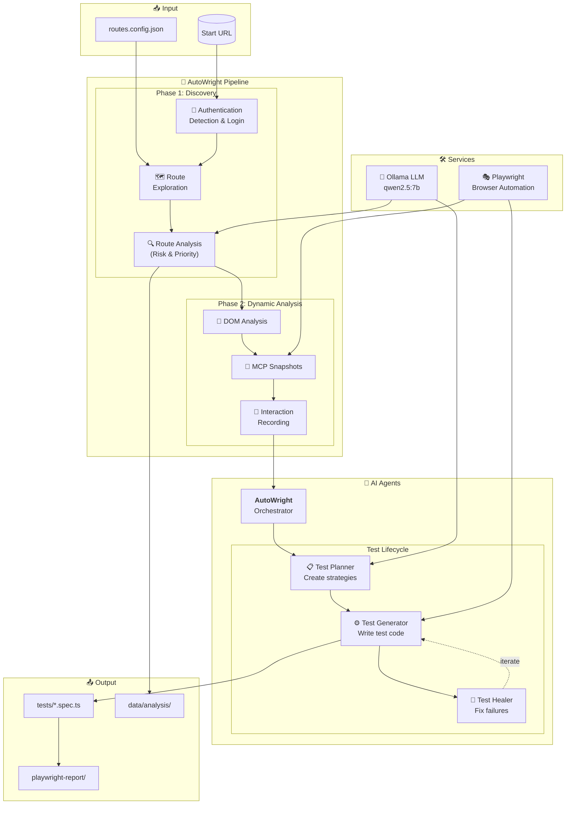

# AutoWright

**Playwright Test Automation Pipeline with AI-Driven Test Generation**

AutoWright is an intelligent test automation framework that automatically discovers, analyzes, and generates comprehensive Playwright tests for web applications using AI agents and dynamic analysis.

## 🚀 Features

- **Intelligent Route Discovery**: Automatically crawls and discovers application routes
- **AI-Powered Analysis**: Uses LLM integration to categorize routes by risk level and business criticality
- **Dynamic Interaction Recording**: Records user interactions and page behaviors
- **Multi-Phase Test Generation**: Plan → Generate → Verify → Heal pipeline
- **Model Context Protocol (MCP) Integration**: Advanced browser automation capabilities
- **Authentication Support**: Handles login flows and session management
- **Comprehensive Test Coverage**: Generates tests for UI interactions, accessibility, and functionality

## 🏗️ Architecture

### Core Components

- **Route Discovery** (`src/route-discovery/`): Explores and maps application routes
- **DOM Analysis** (`src/dom-analysis/`): Analyzes page structure and interactions
- **Authentication** (`src/authentication/`): Manages login flows and session state
- **MCP Integration** (`src/mcp-integration/`): Browser automation via Model Context Protocol
- **Services** (`src/services/`): LLM client and core utilities

### Pipeline Workflow

1. **Authentication Detection**: Identifies login requirements and handles authentication
2. **Route Exploration**: Discovers available routes in the application
3. **Route Analysis**: Categorizes routes using AI analysis (risk, business criticality)
4. **Dynamic Analysis**: Records interactions and generates ARIA snapshots
5. **Test Generation**: Creates comprehensive Playwright tests using specialized agents

### Architecture Diagram



## 🤖 AI Agents

AutoWright includes four specialized agents that work together to automate the testing pipeline:

### 1. AutoWright Agent (`autowright`)
**Main orchestrator agent** that manages the full testing pipeline.

- Coordinates the Plan → Generate → Verify → Heal workflow
- Reads pre-crawled route analysis and dynamic interaction data
- Manages handoffs between specialized agents
- **Usage**: `"Generate tests for make-a-payment"`, `"Autowright run all included routes"`

### 2. Playwright Test Planner (`playwright-test-planner`)
**Test planning specialist** that creates comprehensive test strategies.

- Creates detailed test plans for web applications
- Analyzes ARIA snapshots and interaction data
- Generates structured test suites with clear objectives
- Sets up page contexts for testing
- **Tools**: Browser automation, page navigation, snapshot analysis

### 3. Playwright Test Generator (`playwright-test-generator`)
**Test implementation specialist** that writes actual test code.

- Converts test plans into executable Playwright tests
- Handles complex user interactions and form submissions
- Generates tests for specific user flows and scenarios
- Creates proper test file structure and organization
- **Tools**: Browser interactions, code generation, file operations

### 4. Playwright Test Healer (`playwright-test-healer`)
**Test maintenance specialist** that debugs and fixes failing tests.

- Identifies and resolves test failures
- Updates selectors and interaction patterns
- Analyzes console messages and network requests
- Provides test debugging and maintenance
- **Tools**: Test execution, debugging utilities, locator generation

## 📦 Installation

1. **Clone the repository**
   ```bash
   git clone <repository-url>
   cd autowright
   ```

2. **Install dependencies**
   ```bash
   npm install
   ```

3. **Install Playwright browsers**
   ```bash
   npx playwright install chromium
   ```

4. **Set up environment variables**
   ```bash
   cp .env-sample .env
   # Edit .env with your configuration
   ```

## 🔧 Configuration

### Environment Variables

- `START_URL`: Starting URL for route discovery
- `LLM_MODEL`: LLM model for analysis (default: `qwen2.5:7b`)
- `DEBUG_LLM`: Enable LLM debugging output
- Authentication credentials as needed

### Route Configuration

Routes are configured in `config/routes.config.json`:

```json
[
  {
    "url": "/mortgage/servicing",
    "name": "Servicing",
    "riskLevel": "High",
    "businessCriticality": "Critical",
    "status": "included"
  }
]
```

## 🏃 Usage

### Quick Start

```bash
# Run the full pipeline
npm run dev:main

# Clean start (wipe cache and regenerate everything)
npm run fresh

# Debug flows
npm run dev:debug-flows
```

### Command Line Options

- `--fresh`: Wipe all cached output and LLM cache, run everything from scratch

### Using with VS Code Agents

AutoWright agents can be invoked directly in VS Code:

```
@autowright Generate tests for the payment flow
@playwright-test-planner Create a test plan for user registration
@playwright-test-generator Implement tests for the shopping cart
@playwright-test-healer Fix failing login tests
```

## 📁 Project Structure

```
autowright/
├── .github/agents/          # AI agent configurations
├── config/                  # Route and application configs
├── data/                    # Storage state and analysis data
├── output/                  # Generated route analysis and results
├── scripts/                 # Build and development scripts
├── src/                     # Source code
│   ├── authentication/      # Login and session handling
│   ├── dom-analysis/        # Page structure analysis
│   ├── mcp-integration/     # Model Context Protocol integration
│   ├── route-discovery/     # Route exploration and analysis
│   └── services/            # Core utilities and LLM client
├── tests/                   # Generated Playwright tests
├── test-results/           # Test execution results
└── playwright-report/      # Test reports and traces
```

## 🔍 LLM Integration

AutoWright uses local Ollama for AI-powered analysis:

- **Default Model**: `qwen2.5:7b`
- **Endpoint**: `http://localhost:11434`
- **Features**: Request caching, timeout handling, detailed logging
- **Usage**: Route categorization, risk assessment, DOM analysis

### Setting up Ollama

1. Install [Ollama](https://ollama.ai/)
2. Pull the required model: `ollama pull qwen2.5:7b`
3. Start the Ollama service: `ollama serve`

## 🧪 Generated Tests

AutoWright generates comprehensive test suites including:

- **UI Interaction Tests**: Button clicks, form submissions, navigation
- **Accessibility Tests**: ARIA compliance, keyboard navigation
- **Visual Tests**: Layout verification, responsive design
- **Functional Tests**: Business logic validation, data flow
- **Error Handling**: Edge cases and error scenarios

## 🔧 Development

### Available Scripts

- `npm run dev:main`: Run the main pipeline
- `npm run dev:debug-flows`: Debug interaction flows
- `npm run build:clean`: Clean build artifacts
- `npm run clean`: Clean all generated files
- `npm run fresh`: Full clean and regenerate

### Adding Custom Routes

1. Update `config/routes.config.json`
2. Set route status to "included"
3. Configure risk level and business criticality
4. Run the pipeline to generate tests

## 🤝 Contributing

1. Fork the repository
2. Create a feature branch
3. Make your changes
4. Add tests for new functionality
5. Submit a pull request

## 📝 License

ISC License

## 🆘 Support

- Check the [issues](./issues) for known problems
- Review generated logs in `.cache/llm-responses/`
- Use `DEBUG_LLM=true` for detailed AI interaction logs
- Examine test reports in `playwright-report/`

---

**AutoWright Team** - Intelligent Test Automation for Modern Web Applications